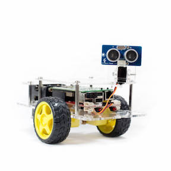

# Robot Maze

An exploration of localization, tracking, and movement algorithms for an autonomous vehicle.

### Motivation

This project represents the optional "hardware" project portion of [CS8803, Artificial Intelligence for Robotics](http://www.omscs.gatech.edu/cs-8803-artificial-intelligence-robotics/), taught by [Dr. Sebastian Thrun](https://en.wikipedia.org/wiki/Sebastian_Thrun), part of Georgia Tech's outstanding [Online Masters of Science in Computer Science](http://www.omscs.gatech.edu/) program.

### Goals

Using the course material, can I program an autonomous vehicle (robot) that will:

 1. Navigate a physical maze, the design of which is **known** to the robot in advance, from a **known** initial position to a **known** goal position?
 1. Navigate a physical maze, the design of which is **known** to the robot in advance, from an **unknown** initial position to a known goal position?
 1. Navigate a physical maze, the design of which is **known** to the robot in advance, from an **unknown** initial position to an **unknown** goal position (the goal being identified by sensing a desired set of conditions)?
 1. Navigate a physical maze, the design of which is **unknown** to the robot in advance, from an **unknown** initial position to an **unknown** goal position (the goal being identified by sensing a desired set of conditions) while mapping the maze as it searches?
 
Furthermore, can I meet the above objectives in a maze that consists of:

 1. A single, straight corridor?
 1. Right angle turns?
 1. Right angle intersections?
 1. Turns and intersections at angles of other than 90 degrees?

### Hardware

For this project, I selected the [GoPiGo](http://www.dexterindustries.com/gopigo/) robot kit from [Dexter Industries](http://www.dexterindustries.com/).  The GoPiGo is a simple, 2-wheeled vehicle with a forward-facing, servo-mounted ultrasonic range sensor, controlled by a Raspberry Pi.

I selected it for the following qualities:

 1. Programmable in Python.
 1. Complete kit - no need to identify and purchase compatible components.
 1. (Relatively) inexpensive at $199.
 1. Easy to assemble.

### Usage

 1. Begin a terminal session on the GoPiGo from another machine on the network.  SSH works fine, but you may also use VNC to view the GoPiGo's desktop and begin a terminal session from there.
 1. Clone the contents of this repository to a directory on the GoPiGo.
 1. Start the robot with `python ./run.py`.

Note that the code requires the `gopigo` Python library which comes preinstalled on the GoPiGo.  The unit tests use the `gopigo_stub` module so that you don't need the `gopigo` library on your development machine.

### License

Use of the contents of this repository is governed by the [MIT License](https://github.com/mattskone/robot_maze/blob/develop/LICENSE).
